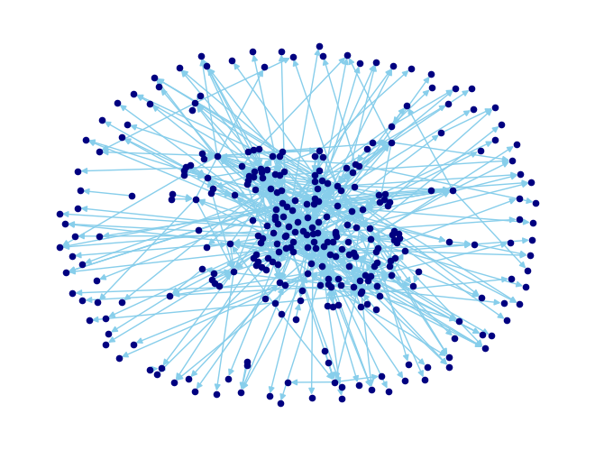

# Football Transfer Network Analysis
 
Análise do mercado de transferências de futebol profissional modelado como grafo direcionado. O projeto mapeia 534 transferências entre 312 clubes (jan–ago 2025), aplica métricas de centralidade e detecção de comunidades para identificar perfis funcionais: **formadores**, **importadores** e **intermediários**.



Desenvolvido como projeto acadêmico na disciplina de Comunicação e Redes (UFABC) e refatorado para portfólio técnico público. O paper original está disponível [aqui](./paper.pdf).
 
---
 
## Estrutura
 
```
├── src/
│   ├── graph.py          # coleta de dados e construção do grafo
│   ├── metrics.py        # métricas do grafo e centralidades
│   ├── communities.py    # detecção de comunidades (Louvain)
│   ├── visualization.py  # plotagem e tabelas
│   └── export.py         # exportação de tabelas para PNG
├── notebooks/
│   ├── 01_data_and_graph.ipynb   # problema, coleta e construção
│   ├── 02_metrics.ipynb          # métricas com narrativa acessível
│   └── 03_results.ipynb          # achados, perfis e comunidades
├── outputs/              # visualizações geradas
├── .env.example          # template de variáveis de ambiente
└── requirements.txt
```
 
---
 
## Setup
 
**Pré-requisitos:** Python 3.11 e [pyenv](https://github.com/pyenv/pyenv)
 
```bash
git clone https://github.com/falcaoalvinho/football-transfer-network-analysis.git
cd football-transfer-network-analysis
```
 
O pyenv seleciona o Python 3.11.0 automaticamente ao entrar no diretório (via `.python-version`). Em seguida, crie e ative o ambiente virtual:
 
```bash
# Linux/macOS
python -m venv .venv
source .venv/bin/activate
 
# Windows
python -m venv .venv
.venv\Scripts\activate
```
 
Instale as dependências e configure as variáveis de ambiente:
 
```bash
pip install -r requirements.txt
cp .env.example .env
```
 
Edite o `.env` com a URL da sua API:
 
```
API_URL=sua_url_aqui
```
 
Inicie o Jupyter e execute os notebooks em ordem:
 
```bash
jupyter notebook
```
 
> **Atenção:** os notebooks 02 e 03 dependem de executar o 01 na mesma sessão Jupyter — o grafo é persistido via `%store` entre eles.
 
---
 
## Fonte de dados
 
Os dados foram coletados manualmente dos sites da [ESPN](https://www.espn.com.br/futebol/mercado-da-bola) e [Transfermarkt](https://www.transfermarkt.com.br) e estruturados em uma planilha Google Sheets exposta como API REST via [Sheety](https://sheety.co). Qualquer alteração na planilha reflete automaticamente em todas as execuções — a chave de acesso é configurada via variável de ambiente.
 
---
 
## Stack
 
Python · NetworkX · Matplotlib · Pandas · NumPy · SciPy · Requests · python-dotenv · Jupyter